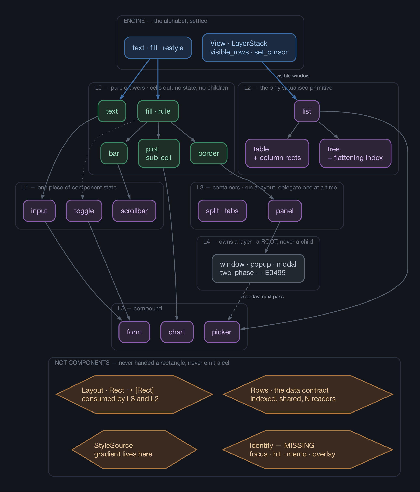

# Component hierarchy: what is primitive relative to what

Working note, 2026-08-17. Not a decision — this is the shape of the question that
`vitui-runtime` and `vitui-components` will be designed against, assembled from what the engine map
has already settled. Nothing here is binding until a ticket resolves it.

The prompt: *build the tree of base components, from simple to composite — and is a layout even a
component?*

**Short answer: no, and neither are windows, rows, cells, scrolling or gradients — for five
different reasons.** The tree exists, but it is not one tree; it is three, and the thing that makes
"is a layout a component" feel wrong is that layout is not a node in any of them.

---

## 1. Three tests for "is X a component"

A component, in this system, is something that:

- **T1** — is handed a **rectangle** and a **draw context**, by someone else;
- **T2** — emits **cells** and nothing else;
- **T3** — takes application data by **shared reference**, and its own state **alongside**, never
  owned together with the data.

T1 comes from ADR 0002 (callers bring rectangles). T2 comes from "the engine only draws" and from
the fact that a component's whole output is what lands in a `View`. T3 is precedence rule 2 from the
map, and it is the hard one: two components must be able to show one table at the same moment,
neither owning it and neither taking `&mut`.

Everything below is these three tests applied.

---

## 2. Running the candidates through

| Candidate | Verdict | Which test, and why |
|---|---|---|
| `text`, `fill`, `border`, `bar`, `plot` | **component** | all three; these are the leaves |
| `input`, `toggle`, `scrollbar` | **component** | all three, with one piece of state under T3 |
| `list`, `table`, `tree` | **component** | all three, plus a data accessor |
| `panel`, `split`, `tabs` | **component** | emits cells (border, title) and delegates an inner rect |
| `form`, `chart`, `picker` | **component** | compound |
| **`layout` / `grid` / `row` / `column`** | **not a component** | fails **T2** — it emits *rectangles*, not cells |
| **`window` / `popup` / `modal`** | **not a child** | passes the tests, fails on *timing* — see §4 |
| **`row` / `cell`** (table sense) | **not a component** | fails **T1** — never handed a rectangle of its own |
| **`gradient`** | **not a component** | fails **T2** — it is a style function |
| **`scroll`** | **not a component** | fails **T2** — it is a view offset, and the engine already owns it |

Three of those deserve the argument rather than the verdict.

### Layout is a function, and the borrow checker already decided this

A layout's signature is `Rect -> [Rect]`. A component's is `(Rect, &Ctx, &Data, &State) -> ()` with
cells as the effect. Different output type, different arity, different lifetime — it is not the same
kind of thing wearing a different name.

It looks like a component in React and JavaFX because JSX and FXML have no other syntax for "these
things go side by side". Rust does not have that problem.

And there is a harder reason than taste. Ticket 12 closed `Screen::split_h`/`split_v` as **not
needed, with two E0499s** proving a column split is inexpressible in safe Rust — you cannot hold two
live `View`s into one surface at once. A layout implemented as a component that *owns* its children
would need exactly that: live views for every child simultaneously. So:

> A container computes all its sub-rectangles **first**, while no view exists, then draws children
> **one at a time**. Layout therefore runs *before* drawing, not interleaved with it, and it can
> never be a node that holds children.

That is not a style preference. It is what compiles.

### A window is a root, not a child

`window`, `popup`, `modal`, `tooltip` and `dropdown` pass all three tests — they are handed a
rectangle, they emit cells, they take data by reference. What disqualifies them as *children* is R2
from ticket 14: `LayerStack::view` holds `&mut` of the stack for the life of the view, so **a
component cannot open its own layer mid-draw** — `E0499`, proved against ticket 12's seam. Overlay
requests are collected during the draw and satisfied after it.

So a combo box is not "an input containing a dropdown". It is an input that *requests* an overlay,
and a list drawn into a fresh layer on the **next** pass. Two components, two passes, one identity
linking them.

### `cell` is already taken, and `row` is a callback

`Cell` in this project means one addressable position in the terminal grid (`CONTEXT.md`).
`vitui-components` must not reuse the word for a table cell — that collision would run through every
ticket, comment and commit message from here on. A table's units are **columns** and a **row
drawer**, and the row drawer is a closure the `list` calls, not something anyone hands a rectangle
to.

---

## 3. There are three trees, and only one of them is the one being asked about

| Tree | What it is | Shape |
|---|---|---|
| **A — the draw tree** | which component called which | the **call stack**, not a data structure |
| **B — the layer stack** | what floats above what | a **flat ordered list**, engine-owned |
| **C — the library graph** | what is built out of what | a **DAG** — `picker` uses both `list` and `input` |

**Tree A does not exist as a value.** Ticket 05 settled that the `View`'s clip stack *is* the call
stack — that is why it allocates nothing and why a child can never widen its clip. In immediate mode
the component hierarchy is the shape of the code, re-created every frame.

> ✅ **Settled by runtime ticket R14.** This note asked for the term to be re-examined before the
> runtime map was drawn; it survived the whole map instead, and R14 removed it. There is no tree of
> nodes anywhere — four separate answers each removed one: the clip stack **is** the call stack, the
> id path is the **closure** tree and not the draw tree (joint R02 × R03), the layer stack is a
> sorted `Vec`, and intrinsic sizing takes no measure walk (R04). The note's own replacement —
> *"an index of identities"* — is wrong too, and R05 and R08 are why: the hit index carries no
> identity path and the focus ring is a separate structure. `CONTEXT.md` now says **frame state**:
> five flat structures — hit index, focus ring, overlay queue, deadline sink, key queue — rebuilt
> from the draw rather than diffed, plus four id-keyed facts that outlive a frame because a widget
> cannot re-declare them by drawing.

**Tree B is flat.** A window inside a window is not nesting; it is two entries with different
z-order. `LayerStack` is a sorted `Vec` with stable `LayerId` (ticket 06) — deliberately not a tree
and not a skip list.

**Tree C is what the diagram shows.**

---

## 4. The library graph



Source: [`docs/img/component-hierarchy.dot`](docs/img/component-hierarchy.dot).

### L0 — pure drawers

Cells out, no state, no children. These sit directly on the engine's three verbs.

| | |
|---|---|
| `text` | wrap, align, truncate over `&str`. Uses the segmentation and width functions the engine exports (ADR 0005) — without them every text component desynchronises its caret, and a runtime that computes columns itself is five columns wrong on one family emoji. |
| `fill` · `rule` | a rectangle or a line of one cluster and one style |
| `border` | four fills plus corners, **with the glyph set chosen from `Capabilities::glyphs`** — this is where ticket 11's degradation actually lands in the component library, and it is a legitimate choice at the source rather than a substitution behind anyone's back |
| `bar` | a proportion rendered as a run of cells, sub-cell resolution through the eighth-block glyphs |
| `plot` | the sub-cell rasteriser — braille, quadrants, sextants. Not a composite: it is a leaf, and it is the core of the scene that decided three engine tickets. |

### L1 — one piece of component state

`input` (a `&str` plus a caret index, and the caret sink from ADR 0005), `toggle` (a bool),
`scrollbar` (reads an offset, owns nothing). The defining property is T3: the state is passed
alongside the data, never owned with it.

### L2 — the only virtualised primitive, and its two variants

This is the strongest hierarchy claim in the document, and it is backed by numbers rather than
aesthetics.

**`list` is the primitive**, because the engine offers exactly one tool for virtualisation:
`visible_rows()`, measured flat at **54 µs across 1k, 100k and 1M rows** (ticket 05). A free
per-cell discard is *not* enough — at 3.6 ns each, drawing all 1M rows of a tree burns 3.68 ms of
pure rejection.

- **`table` = `list` + column rectangles.** The row drawer draws columns; the widths come from a
  layout, which is a function, not a child.
- **`tree` = `list` + a flattening index.** Ticket 14 measured an O(k) row lookup in a 1M-node tree
  at **9.76 ms a frame — 656× the O(1) form**. So the index must be O(1) and expansion must *splice*
  rather than rebuild, or the 100 µs budget is gone before the engine is reached.

Table and tree are therefore not siblings of list. Each is list plus exactly one thing.

### L3 — containers

`panel` = border + title + an inner rectangle + one delegated call. `split` and `tabs` = a layout
plus sequential delegation. Per §2, a container never holds two children's views at once.

### L4 — owns a layer

`window`, `popup`, `modal`, `tooltip`. Two-phase, per R2. A shadow is an **operator layer** with a
`Mix`, occluded by its own window through z-order, so no region arithmetic exists (ticket 06). One
trap already recorded: `Mix` clears the extended-style bit, so **a shadow crossing a hyperlink
deletes it** (ticket 16) — a component library that puts shadows under links will meet this.

### L5 — compound

`form` = inputs + labels + focus routing. `chart` = `plot` + axes + legend, plus a **memoised**
aggregate — ticket 14 measured a maximum over 1M rows at **130.23 µs a frame against 0.4 ns
memoised**, more than the whole damage-tracked budget. `picker` = `input` + overlay request +
`list`, in two passes.

### The gradient, because requirement 10 names it

> *Putting a gradient on a progress bar must be trivially easy.*

The design that makes it trivial falls out of ticket 06's finding that **a gradient is not a blend
mode** — it is a `fill` with a varying style, which the compositor never sees. So:

```rust
bar(cx, area, 0.62, Style::new().fg(GREEN));         // flat
bar(cx, area, 0.62, Gradient::horizontal(RED, GREEN)); // gradient
```

`bar` takes an `impl Into<StyleSource>`; a `Style` and a `Gradient` both convert. One parameter, no
new concept, no component. That is the whole feature.

---

## 5. What has no home yet

Three things are neither engine nor component. Two are types. **One is a missing layer, and it is
the answer to "или мы поймём что нужен ещё какой-то слой".**

### 5.1 Identity — the missing layer

Immediate mode has no mount, so nothing is naturally named. But **five separate mechanisms need a
name for "this widget" that survives between frames**:

| mechanism | needs identity for |
|---|---|
| focus routing | "send keys here" — focus is routing, not enablement (ticket 10) |
| hit-testing | the runtime's own spatial index, below `topmost_at` |
| interest | declared during the draw, with the same call as the hit region |
| memo invalidation | an aggregate's cache key, which "an application cannot silently forget to bump" (ticket 14) |
| overlay ownership | which component's dropdown this layer is, across two passes |
| scroll association | which list this offset belongs to |

Nothing on the map decides where that name comes from. The usual answer is a stable id derived from
the call-site path plus an explicit key, hashed. It is not a crate and not a component — it is a
module inside `vitui-runtime`, sitting **under** the draw context, and everything above depends on
it. **This is the layer that is genuinely missing.**

### 5.2 `Rows` — the data contract

R4 says virtualisation needs indexed access; precedence rule 2 says shared reference, N readers, no
`&mut`. Together those are a contract every collection component demands of application data, and it
is the only place the runtime touches the *shape* of an application's data. It would be
**`vitui-runtime`'s first trait** — the engine has none at all (ticket 12: twenty types, sixty-two
functions, no traits), so introducing one is a decision, not a detail.

### 5.3 `StyleSource` — a function, not a layer

`Fn(x, y) -> Style`, consumed by `fill` and `bar`. §4 above. Worth naming only so nobody proposes a
`Gradient` component.

---

## 6. The fork that decides whether a component is a function or a trait

This is the single question that most changes the runtime's design, and it hides inside layout.

If layout is `Rect -> [Rect]`, it **cannot ask "how tall is this text at width 40"**. That is
intrinsic sizing, and there are only two exits:

**(a) No measurement.** Layout is purely constraint-driven — fixed, weighted, min/max — the way tmux
and every terminal window manager does it. A component stays a **plain function**. There is no
component trait, no node type, no two-pass walk, and the call tree remains the only tree.

**(b) A measure pass.** A component must then be callable in two modes — *measure* and *draw* —
which forces a trait with two methods, forces the runtime to walk a structure rather than run code,
and reintroduces exactly the retained tree that ticket 05's clip-stack-is-the-call-stack finding
deleted.

**Leaning (a)**, for three reasons already on the map: terminal cells are integral and the map
already flags that flexbox fractions open one-column gaps; the engine exports segmentation and width
as functions over a caller's `&str` (ADR 0005), so the one real measurement case — text wrapping
height — can be answered without calling a component at all; and (b) buys flexibility at the cost of
requirement 10, which asks for ergonomics *at least as simple as* Swing and React.

But it is a fork, not a foregone conclusion, and it should be a ticket on the runtime map rather
than a default that arrives by accident.

---

## 7. Consequences, if this shape holds

**`vitui-runtime` owns** — the draw context, **identity**, layout as a function library, focus
routing, the hit index, event routing, the memo, key maps, the theme, and the two-phase overlay
protocol. Not a scene tree, and — since R13 — **not a reactivity graph either**: `Memo` and
`Revision` are the runtime's, the graph that keys them is an application's, and `vitui-signals` is
the crate for the shape that wants one.

**`vitui-components` owns** — L0 through L5 and nothing else. Every one of them is a function over
`(&mut Ctx, Rect, &Data, &State)`, and none of them names an engine type.

**Reserved words** — `cell`, `layer`, `surface`, `view`, `run`, `frame`, `damage` all belong to the
engine's glossary. The component library needs its own words for the table's units.

**What is a component, in one sentence** — something handed a rectangle that emits cells, reads data
it does not own, and keeps its state beside it. Everything that fails that sentence is a function, a
contract, or a layer.

---

## 8. Corrections, 2026-08-17

This note was written before the component catalogue was assembled. Two of its verdicts did
not survive that, and both are recorded here rather than silently edited, because the reasoning
that produced them is instructive.

**`scroll` — "not a component" is half right, and the half it gets wrong is a whole family.**
A *scroll offset* is indeed a view transform the engine already owns, and §2's verdict holds
for it. A **scroll area** — a container that owns two offsets as state, clips its child, draws
bars, routes the wheel with chaining and answers scroll-into-view — passes all three tests and
is a legitimate L3 container. It is also **not** `list`: a scroll area costs its *content*
(discards are 3.6 ns a cell, not free), while `list` virtualises by index and costs its
*visible window*. Both are needed. See the survey's F3.

**Expand/collapse was absent entirely**, along with media, file preview and system monitoring.
The reason is structural and worth keeping: this note reasoned from *widget inventories*, and
inventories hide anything that is a container **attribute** in a retained or CSS framework —
`overflow`, `<details>`, `ScrolledWindow`, `Expander`. In immediate mode there is no container
object to attribute anything to, so every one of those must be an explicit component. Any
future catalogue work should sweep application vocabularies (file managers, monitors, git
clients) as well as library inventories.

Current treatment: `.scratch/vitui-components-architecture/research/01-component-library-survey.md`
(fifteen families, ~430 entries), with the architecture proposals beside it.
