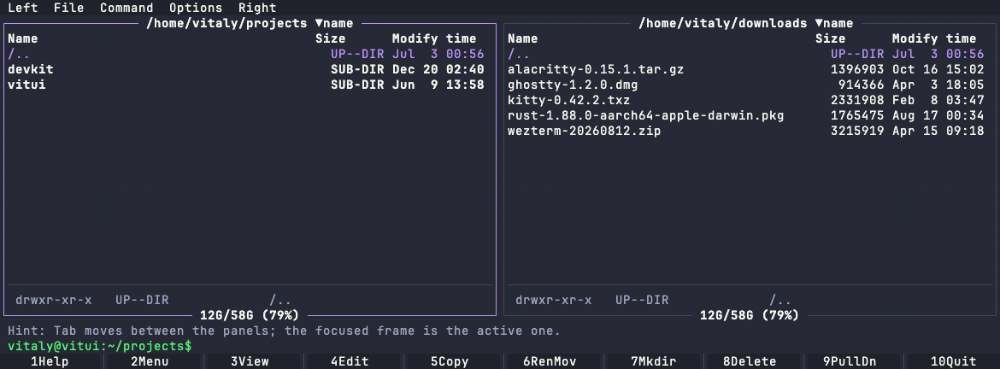
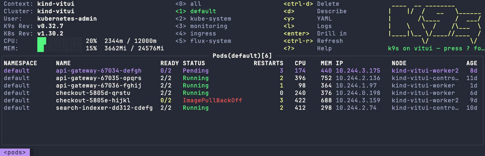
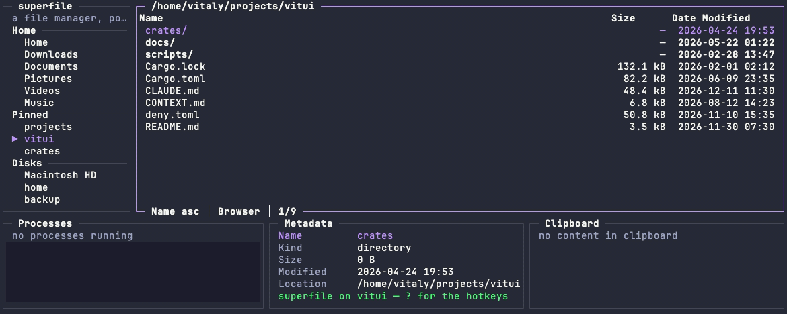

<div align="center">



[![Crates.io][crates-badge]][crates] &nbsp;·&nbsp; [![Docs][docs-badge]][docs] &nbsp;·&nbsp; [![CI][ci-badge]][ci] &nbsp;·&nbsp; [![Licence][licence-badge]][licence]

</div>

# vitui

A Rust TUI library: layered terminal rendering with damage tracking, built so that **frame cost is
proportional to visible cells, never to data volume**. That is the engine's invariant and it holds
there without exception. Above it, a component that cannot know which of a million points land in
its rectangle without looking at them splits the cost instead — **the frame costs the rectangle,
the edit costs the data**, behind a memo — and every component that takes a data volume is gated on
both halves.

Three crates behind one facade. `vitui-engine` is everything that touches the terminal — cells,
surfaces, layers, compositing, damage, input, and the bytes on the wire. `vitui-runtime` is
everything above it — layout, identity, focus, hit-testing, routing, key maps, theming, overlays and
the data contract. `vitui-components` is the widget library. An application that wants only fast
layered output can depend on `vitui-engine` alone and never meet a layout type.

## Quickstart

**The library is not released yet.** The four names on crates.io are `0.0.1` placeholders holding
the namespace; `0.1.0` is the first version with code in it. Until then the way to run this is the
repository:

```sh
git clone https://github.com/vitui-rs/vitui
cd vitui
cargo run -p vitui-apps --example counter
```

That example is below in full. It is a port of ratatui's own counter tutorial, chosen because a
port is the fairest thing to show: its shape is not ours to argue with, so whatever it cannot say
here is a fact about this surface rather than a taste.

```rust
use vitui_components::structure::{PanelOpts, panel_with};
use vitui_components::text::{Justify, TextOpts, text_with};
use vitui_runtime::ctx::Driver;
use vitui_runtime::keys::{ActionId, Chord, Code, KeyMap};
use vitui_runtime::work::Wake;
use vitui_runtime::{Ctx, Interest, Themes};

struct App {
    counter: u8,
    exit: bool,
}

const DEC: ActionId = 1;
const INC: ActionId = 2;
const QUIT: ActionId = 3;

fn key_map() -> KeyMap {
    KeyMap::new()
        .bind(&[Chord::new(Code::Left), Chord::key('h')], DEC, "Decrement")
        .bind(
            &[Chord::new(Code::Right), Chord::key('l')],
            INC,
            "Increment",
        )
        .bind(&[Chord::key('q')], QUIT, "Quit")
}

impl App {
    fn ui(&mut self, cx: &mut Ctx<'_, '_>, map: &KeyMap) {
        cx.key_map(map);

        let block = panel_with(
            cx,
            cx.area(),
            " Counter App Tutorial ",
            " Decrement <Left> Increment <Right> Quit <Q> ",
            &PanelOpts {
                padded: false,
                justify: Justify::Middle,
                ..Default::default()
            },
        );

        text_with(
            cx,
            block.interior,
            &format!("Value: {}", self.counter),
            &TextOpts {
                justify: Justify::Middle,
                ..Default::default()
            },
        );

        let sink = cx.id();
        let _ = cx.interact(sink, cx.area(), Interest::FOCUS);
        if cx.focused().is_none() {
            cx.focus(sink);
        }
        while let Some(key) = cx.next_key(sink) {
            match cx.action(&key) {
                Some(DEC) => self.counter = self.counter.saturating_sub(1),
                Some(INC) => self.counter = self.counter.saturating_add(1),
                Some(QUIT) => self.exit = true,
                _ => cx.decline(key),
            }
        }
    }
}

fn main() {
    let map = key_map();
    let mut app = App {
        counter: 0,
        exit: false,
    };

    let mut driver = match Driver::attach(Default::default(), *Themes::standard().theme()) {
        Ok(driver) => driver,
        Err(why) => {
            eprintln!("vitui could not attach: {why}");
            return;
        }
    };

    driver.frame(|cx| app.ui(cx, &map));

    while !app.exit {
        match driver.wait() {
            Wake::Quit => break,
            Wake::Input | Wake::Posted | Wake::Deadline => {}
        }
        driver.frame(|cx| app.ui(cx, &map));
    }
}
```

Three things that example is showing, and they are the whole model: **the library holds no state** —
`ui` runs top to bottom every frame and a component is a function taking the rectangle it draws in;
**there is nothing to register** — no widget object, no scene tree, no lifecycle; and **a key nobody
wants goes back on the queue** with `cx.decline`, because a frame consumes at most one routing edge.

## What is in it

| | |
|---|---|
| **29 components** | text, panel, chip, button, field, collection, table, tree, select, overlay, scroll area, scrollbar, sticky, collapsible, chart, plot, slider, file picker, file preview pane, checkbox, radio, switch, meter, sparkline, rule, status bar, pagination, form, spinner |
| **21 applications** | one file each, written against the component surface with no access to the engine — including ports of Midnight Commander, k9s and superfile. `cargo run -p vitui-apps --example <name>` |
| **14 themes** | roles, not colours: a component names a role and never a paint |

<div align="center">


</div>

## The frame, as a sequence

```text
Engine::new(Config) -> attach() -> (Screen, WakeHandle)
  |                                 raw mode, the capability queries, the prologue -- and only
  |                                 then the render thread, where no concurrency existed yet
  |
  +- layers()                add layers; view(id) to draw into one
  |   +- the verbs           text - fill - restyle, marking damage as they write
  |
  +- set_mouse(level)        what the frame's components asked the pointer for, as a `max`
  +- set_cursor(caret)       where the caret goes, applied after the frame's last write
  |
  +- present() -> Presented  the app thread:
                               lease a packet, or fold this frame into the next one
                               composite the damaged rectangles bottom-up
                               pack runs and their cells into the packet
                               submit, clear damage, return
                             the render thread:
                               take the packet, serialise against the mirror,
                               one write into the sink, give the packet back
```

Three threads and one synchronisation primitive: a `Mutex<Shared>` with two condvars, and a pool of
exactly two packets. There is no backpressure, because dropping an intermediate frame is implemented
as *never composing it* — the app thread composites only after the renderer signals it is free.
`Config::clock` selects a deterministic single-thread mode in which both halves run on the calling
thread before `present` returns, same mailbox, same packet, same bytes; that mode is public API
rather than test scaffolding.

**The engine does not own the loop.** It hands out the verbs and `present`, and the runtime drives.
Damage is marked by the verbs and cleared by `present`, and neither is reachable from outside — which
is also why nothing above the engine can force a full repaint.

## The decisions that constrain everything

These are architectural, not stylistic. Each cost a session and has a decision record or a
measurement behind it.

- **The engine lays nothing out.** Callers bring rectangles; no layout concept may enter through the
  `Surface` API.
- **The engine never iterates application data.** It offers clipping and offset viewports; culling is
  the caller's job. Checked at both ends: a component drawing against `visible_rows()` costs 54 µs
  flat at 1 000, 100 000 and 1 000 000 rows, and a 1k-row list and a 1M-row list showing the same 80
  rows produce identical damage, identical run counts and identical emitted cells.
- **crossterm is invisible.** Input and terminal mode only, never output, and it appears in no public
  signature.
- **Damage is marked at write time, not derived by diffing.** Prior art measured ratatui's
  full-buffer diff at ~170 µs on 300×80 — already over the budget for a whole frame.
- **A cell holds an interned grapheme-cluster handle, not a `char`**, forced by UAX #29. 16 bytes,
  align 4, no padding hole.
- **Dependency policy is enforced, not reviewed.** The engine takes `crossterm` plus
  build-script-generated UCD tables; the runtime takes nothing at all. `deny.toml` carries it, so a
  crate reaching for an async runtime meets `error[banned]` rather than a code review.
- **No `unsafe` in the engine** (`#![forbid(unsafe_code)]`), no traits on the public surface, no
  executor, no thread pool, and no way to read a cell back off the screen.

## Performance

The budget is a set of CI gates, not aspirations:

| | budget |
|---|---|
| full-screen composition, 300×80 (≈24 000 cells) | < 1 ms |
| typical damage-tracked frame | < 100 µs |
| steady-state 60 fps animation | < 5% of one core |
| allocations during frame composition | zero |
| a genuinely idle application | zero CPU |

**Measured on an Apple M1 Max (aarch64), release, on a 300×80 grid.** The worst *realistic* frame
costs ≈149 µs against the 1 ms budget — component drawing ≈45 µs, compositing 43.9 µs at 50 layers,
packing 53.5 µs, damage marking 6.88 µs, the mailbox critical section 32.1 ns, the overrun detector
45.7 ns. Roughly 6.7× of headroom, and that is what keeps parallel compositing out of scope rather
than a claim that it would not help.

**One of those six figures is not a measurement and it is the largest.** Component drawing at ≈45 µs
is a prototype's number — this is the engine, and the components sit two crates above it — so a third
of the total is an estimate. It stays in the sum because a total that dropped it would report a
better frame by removing the biggest thing the app thread does. The other five were re-measured
against the engine that exists, and four of the five came down: the packing row is the *hostile* arm
where every cell carries a distinct style, and the realistic 1% arm is 22.0–23.7 µs.

Steady state is measured rather than derived — a real 60 Hz loop for thirty seconds, read off
`/usr/bin/time`: **0.133% of one core over 1 800 frames**, 37.6× under the 5% budget, with every
thread and the wire in it. Idle over thirty seconds: `0.00 user, 0.00 sys, 0 voluntary context
switches`, where a 120 Hz ticker would have woken 3 600 times.

### Against other libraries

`compare/` runs the same nine described scenes against ratatui and Textual. **It reports; it does
not gate** — four external projects' versions cannot decide whether this repository's changes land.
Apple M1 Max, macOS 26.5.2, rustc 1.97.1, python 3.14.6; 120×40, 120 frames per scene.

**Two of the five arms are ours and that is the point of the table.** `vitui` writes the cells that
changed; `vitui-runtime` rebuilds the whole picture every frame, because that is what code looks
like one layer up, and it is the layer an application is actually written against.

Marginal bytes for one more frame at the `truecolor` tier — `(bytes(120) - bytes(1)) / 119`, with the
session prologue and first paint differenced out:

| scene | vitui | vitui-runtime | ratatui | textual |
|---|---|---|---|---|
| `caret` | 9.5 | 9.5 | 28.5 | 25.0 |
| `status-line` | 22.4 | 52.4 | 46.5 | 47.5 |
| `list-scroll` | 572.3 | 604.3 | 704.7 | 5124.0 |
| `full-repaint` | 96408.0 | 96420.0 | 106216.0 | 111036.0 |
| `modal-over-list` | 19.0 | 47.0 | 36.0 | 17.0 |
| `unchanged` | 0.0 | 0.0 | 25.0 | 5124.0 |
| `fade` | 1394.7 | 1394.7 | 1413.7 | 2618.3 |
| `scattered` | 82.2 | 114.2 | 127.2 | 199.0 |
| `filter-shrink` | 76.0 | 108.0 | 110.7 | 291.2 |

| | vitui | vitui-runtime | ratatui | textual |
|---|---|---|---|---|
| CPU, caret at 60 Hz | 0.23% of a core | 0.27% | 0.64% | 9.52% |
| keystroke to wire, µs p50 / p99 | 44 / 111 | 89 / 246 | 1045 / 11947 | 2972 / 36123 |

**`unchanged` is the row with a known right answer** — sixty frames with a job in flight and nothing
on the screen moving — and it is the one place the table is a verdict rather than a comparison.
ratatui's 25 bytes are not a diff result: they are a reset-and-hide-cursor epilogue written whether
or not the diff produced a cell, so an idle ratatui application at 60 Hz spends 1.5 kB a second
saying nothing. Textual charges the same for a screen that did not change as for one that scrolled.

**The runtime costs about thirty bytes a frame, flat, and it is not the redraw.** Rebuilding 4 800
cells against writing forty is worth *zero* on the wire — `caret`, `unchanged` and `fade` are exact
— because the engine's equality filter absorbs all of it. The thirty bytes are one SGR sequence, and
at the `no-color` tier the two arms are byte-identical on eight of the nine scenes.

The shape is what the architecture predicts — the advantage is largest where the change is smallest,
and `full-repaint` at 1.10× compares nothing but the encoder. **Four caveats belong with these
numbers and [`compare/FINDINGS.md`](compare/FINDINGS.md) argues each at length:** `list-scroll` at
1.2× is not a win and should be, because the scene as written moves the highlight with the list and
puts the scroll region out of reach for both arms; the latency figure is not what a user would feel,
because the harness never crosses the mailbox; Textual wins `modal-over-list`, and one row of nine is
not a rounding error; and notcurses — the honest ceiling — is missing, which reads as a win and is
the single easiest way for this suite to become dishonest.

## Status

All three layers are implementation-complete and the v1 freeze is **29 of 29 components built**.
The library is **not released**: `vitui`, `vitui-engine`, `vitui-runtime` and `vitui-components` are
on crates.io as `0.0.1` placeholders holding the names, and `0.1.0` will be the first version with
code in it. There is no stability promise before 0.x.

What has been run, what has not, and the verification numbers behind those two sentences are in
[`docs/status.md`](docs/status.md) — including the eight-terminal conformance matrix and the one
supported terminal nobody has driven through it.

## Alternatives

Named here because a reader comparing them deserves the comparison, and because two of these were
measured above.

- **[ratatui](https://github.com/ratatui/ratatui)** — the default choice in Rust, by a distance: the
  largest ecosystem, the most widgets, templates, a documentation site and a community. Immediate
  mode over a full-buffer diff. If you want the safe answer, it is this one.
- **[cursive](https://github.com/gyscos/cursive)** — a retained view tree with callbacks, which is a
  different model rather than a slower one; closer to a classic widget toolkit.
- **[iocraft](https://github.com/ccbrown/iocraft)** — declarative and React-shaped, with flexbox
  layout and a macro syntax.
- **[notcurses](https://github.com/dankamongmen/notcurses)** — C, and the performance ceiling this
  workspace measures itself against in principle and has not yet measured itself against in fact.

## Building

Requires **Rust 1.88** (`rust-version` in `Cargo.toml`), verified by the `msrv` job rather than
declared. Edition 2024.

```sh
cargo build --workspace
cargo test --workspace -- --test-threads=1   # serialised: the allocation gates count globally
cargo clippy --workspace --all-targets
cargo fmt --all
cargo deny check
cargo run --release --example budget -p vitui-engine   # the register and the ledger, runnable
```

Warnings are build failures locally exactly as in CI — `[workspace.lints.rust] warnings = "deny"`,
which unlike a committed `RUSTFLAGS` cannot be switched off from a shell.

`fuzz/` holds two libFuzzer targets and is a detached workspace with its own `deny.toml`, because
`cargo-fuzz` needs nightly and `libfuzzer-sys` and the engine's dependency policy will not have
them. The committed corpus replayed by `cargo test` is the gate; the fuzzers themselves are a soak.

### Where the gates run, and what the badge reports

**The visible workflows are not the gate set.** `.github/workflows/` holds the four things a local
runner cannot do: `ci.yml`, the macOS/Linux/Windows matrix; `soak.yml`, the weekly fuzz soak;
`compare.yml`, the monthly comparative suite; and `site.yml`, which deploys the documentation site.
The two scheduled ones upload a report and never push one.

The five jobs that decide whether a change lands are `.gitlab-ci.yml`'s, and they run on a self-hosted
GitLab that is not publicly reachable. The file ships because it is the definition of what is gated
rather than a link to a pipeline — each of the five is reproducible with the commands below, so the
gate set runs without the runner:

| job | what it runs |
|---|---|
| `test` | `cargo fmt --all --check`, clippy over all targets and over the engine's `fuzz` feature, `cargo doc --workspace --no-deps`, `cargo test --workspace -- --test-threads=1` and then the same suite again under `script(1)` on a pty, `cargo run -p vitui-alloc-probe --example harness_race`, five of the scripts under `scripts/`, and `conform/`'s own suite over the committed captures |
| `msrv` | `cargo check --workspace --all-targets` and the same for the engine's `fuzz` feature, on 1.88.0 — after `rustc --version \| grep -q` **asserts** the toolchain is that one, so a retagged image cannot turn this into a second `test` run |
| `deny` | `cargo deny check`, here and again in `fuzz/` |
| `budget` | `cargo run --release --example budget -p vitui-engine`, then the runtime's `frame` report and `scripts/observer-gate.sh` |
| `idle` | `scripts/idle-gate.sh 30` and `scripts/steady-report.sh 30` |

The CI badge above reports the matrix.

## Documents

**All of it as a site.** [`site/`](site) builds this repository's own markdown — the guide, the three
specs, the fifty-three decision records and the glossary — into a static site, alongside four pages
that only exist there: a getting-started tutorial, the component list generated from the freeze, the
applications, and the two evidence suites read as tables. `cd site && npm install && npm run dev`
reads it locally. It is published at <https://vitui-rs.github.io> from the moment this repository is
pushed and a deploy key exists; [`site/README.md`](site/README.md) is the procedure.

**Writing your own components:** [`docs/guide/`](docs/guide) is the manual — thirteen chapters from
the frame to shipping a component crate, with a runnable worked example in
[`examples/component-handbook/`](examples/component-handbook) that depends on `vitui-runtime` alone.

- [`docs/guide/`](docs/guide) — how to build components on the engine and the runtime.
- [`docs/status.md`](docs/status.md) — what has been run, on what, and the verification registers.
- [`CONTEXT.md`](CONTEXT.md) — the glossary. Its terms are used everywhere else without re-definition.
- [`docs/adr/`](docs/adr) — the decisions that are hard to reverse and surprising without context.
- [`docs/spec/`](docs/spec) — the three specifications the layers are built against: the
  [engine](docs/spec/engine.md), the [runtime](docs/spec/runtime.md) and the
  [components](docs/spec/components.md). They are the authority on what each layer owes, and the
  components one carries the v1 freeze.
- [`compare/README.md`](compare/README.md), [`compare/SCENES.md`](compare/SCENES.md) — what the
  comparative scenes are and how they are read.
- [`conform/README.md`](conform/README.md) — the conformance suite and its eight arms.
- [`fuzz/README.md`](fuzz/README.md) — the whole soak procedure.

## Licence

Licensed under the Apache License, Version 2.0 ([LICENSE](LICENSE), or
<http://www.apache.org/licenses/LICENSE-2.0>).

Unless you explicitly state otherwise, any contribution intentionally submitted for inclusion in this
work by you, as defined in the Apache-2.0 licence, shall be licensed as above, without any additional
terms or conditions.

[crates]: https://crates.io/crates/vitui
[crates-badge]: https://img.shields.io/crates/v/vitui?style=flat-square&color=a86a06
[docs]: https://docs.rs/vitui
[docs-badge]: https://img.shields.io/docsrs/vitui?style=flat-square
[ci]: https://github.com/vitui-rs/vitui/actions/workflows/ci.yml
[ci-badge]: https://img.shields.io/github/actions/workflow/status/vitui-rs/vitui/ci.yml?style=flat-square
[licence]: LICENSE
[licence-badge]: https://img.shields.io/badge/licence-Apache--2.0-blue?style=flat-square
